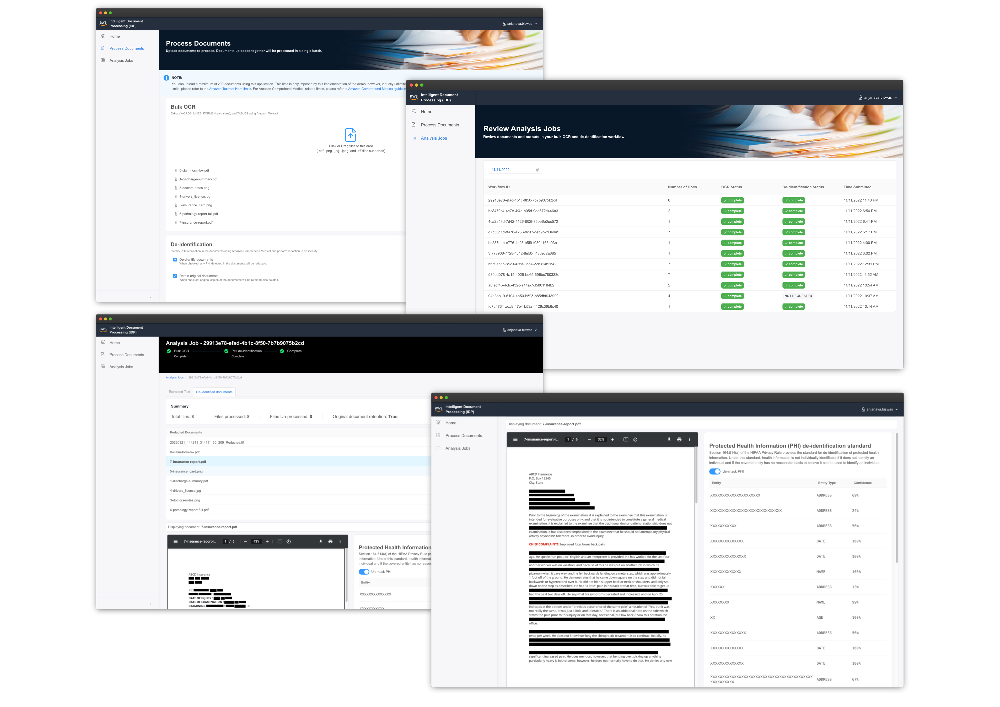
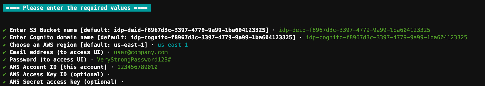
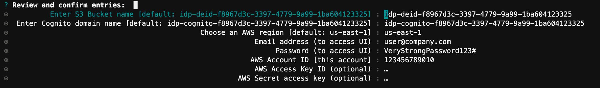
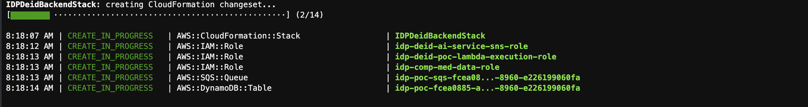

# PHI de-identification of documents with Amazon Comprehend Medical and Amazon Textract

[](https://github.com/aws-samples/aws-ai-phi-deidentification/releases)
[](https://github.com/aws-samples/amazon-eks-arch-apache-solr/blob/main/LICENSE)

According to U.S. Dept of Health and Human Services (HHS) -

> The increasing adoption of health information technologies in the United States accelerates their potential to facilitate beneficial studies that combine large, complex data sets from multiple sources. The process of de-identification, by which identifiers are removed from the health information, mitigates privacy risks to individuals and thereby supports the secondary use of data for comparative effectiveness studies, policy assessment, life sciences research, and other endeavors.

For more information and rationale behind de-identification of documents containing PHI data, visit HHS guidance on [Methods for De-identification of PHI](https://www.hhs.gov/hipaa/for-professionals/privacy/special-topics/de-identification/index.html).

This project is a single command deployable solution developed with Amazon Cloud Development Kit (CDK) for provisioning resources in AWS cloud and a front-end application built with [React](https://reactjs.org/) and [create-react-app](https://create-react-app.dev/) scaffolding. It is capable of extracting text using [Amazon Textract](https://aws.amazon.com/textract/) powered ML based OCR, detect PHI entities using [Amazon Comprehend Medical](https://aws.amazon.com/comprehend/medical/), and de-identify (redact) documents in bulk. Supported documents can be in PDF, TIFF, PNG, or JPEG formats.



> :warning: **This application software or parts of this application software are not a substitute for professional medical advice, diagnosis, or treatment. Identify the right confidence threshold for your use case, and use high confidence thresholds in situations that require high accuracy. For certain use cases, results should be reviewed and verified by appropriately trained human reviewers. All operations of Amazon Comprehend Medical should only be used in patient care scenarios after review for accuracy and sound medical judgment by trained medical professionals.**

> :warning: Your AWS account may incur charges for resources used by AWS Cloud9, Amazon Textract, and Amazon Comprehend Medical. However, Amazon Textract, and Amazon Comprehend Medical are free to try as part of [AWS Free Tier](https://aws.amazon.com/free/).

---

## Get Started

This mono-repo contains both the AWS CDK Application and React Application. The mono-repo is managed via [npm `workspaces`](https://docs.npmjs.com/cli/v7/using-npm/workspaces). The available workspaces as defined at the root of the project's `package.json` file are listed below-

- `idp-react-app` : The React application
- `idp-cdk-app` : The AWS Cloud Development Kit application (CDK)

Since this is a mono-repo scaffolded using NPM workspaces, all commands shown below can be executed from the root of the project directory.

Setup a AWS Cloud9 environment by clicking the launch stack button below or follow the [step-by-step instructions](./documentation/get-started.md) to deploy an AWS Cloud9 environment. _(estimated time to deploy 10 minutes)_

[](https://console.aws.amazon.com/cloudformation/home?region=us-east-2#/stacks/new?stackName=idp-poc-demo&templateURL=https://idp-assets-wwso.s3.us-east-2.amazonaws.com/cfn/cloud9.yaml)

---

## Installation

This project provides a single command installation. Once you have your Cloud 9 environment, open a [new terminal](./documentation/get-started.md#verify-dependencies-optional) and run the command shown below to clone the repo. You can also run this in your local machine. However, please ensure you have all [dependencies](./documentation/get-started.md#getting-started).

```bash
git clone <repo_url> idp-de-identification
```

Once the repo has been cloned, changed into the project's directory-

```bash
cd idp-de-identification
```

From the project's root, run the following command-

```bash
npm run cdk-app-install
```

This command will kick-start the setup and installation process. It will eventually prompt you to enter the required information as shown below



The wizard will fill out default values for the Amazon S3 bucket, and Amazon Cognito domain name. You can keep these default values or enter the values manually. Subsequently, choose the region you wish to deploy this application into. Enter your email and password, you will use this to log-on to the UI application that will be deployed.

- If you are in a Cloud9 environment, then the AWS Account ID will be auto-populated for you, the AWS access key ID, and secret access keys are optional in this case. 
- If you are not on a Cloud9 environment, you will have to enter the AWS account ID, and AWS access key ID, and secret access keys.

Once you have entered all the values, hit return/enter and review the values, once done hit return/enter again.



The setup process will now deploy all the necessary resources into the AWS account. The entire process may take about 10-15 mins to complete. 



Once the deployment is complete, you should see the application URL printed in the terminal as shown below. The web-application can be accessed via this URL.

```
✨  Total time: 8.04s

IDP Proof of Concept Application deployed and accessible at url → https://main.xxxxxxxxxxxxx.amplifyapp.com

```

### What does the setup do?

- It installs all dependencies for the project
- [Bootstraps](https://docs.aws.amazon.com/cdk/v2/guide/bootstrapping.html) the CDK application with the AWS account ID provided
- Deploys the CDK application that deploys various resources listed below:
  - Amazon S3 bucket
  - IAM Roles
  - Amazon Cognito UserPool and IdentityPool
  - AWS Lambda Functions
  - Amazon DynamoDB Table
  - Amazon SQS queue
  - Amazon SNS Topic
  - Amazon Step Functions state machine
- Builds the React (UI) application
- Deploys the UI application using [AWS Amplify Hosting](https://aws.amazon.com/amplify/hosting/).

## Cleaning up

> ⚠️ **WARNING**: The step below is destructive, which means that all data including the documents (original, and redacted) in the Amazon S3 bucket, the Amazon DynamoDB table will be deleted. It is recommended that you back up the S3 bucket before deleting the application.

To clean-up and delete the application and all the corresponding AWS resources from your account, run the following command from the project's root.

```bash
npm run cdk-app-destroy
```

## Troubleshooting

For troubleshooting common issues while deployment or customization check the [troubleshooting](./documentation/troubleshooting.md) document.

---

## Further development and customization

You can customize the CDK app and the React app to suit your needs. Below are some of the common steps that you may perform while customizing this project.

### React App

Installing dependencies for the React application

```bash
npm install --save -w idp-react-app
```

To install a new dependency for the React app

```bash
npm install --save <lib> -w idp-react-app
```

Where `<lib>` is the dependency.

To start the React app server in your local machine with hot-reload feature -

```bash
npm run react-app-start
```

To build the react app for deployment

```bash
npm run react-app-build
```

---

### AWS CDK App

Install dependencies for your AWS CDK app.

```bash
npm install --save -w idp-cdk-app
```

> WARNING ⚠️ : You must bootstrap CDK before proceeding with deployment. Please refer to [documentation](https://docs.aws.amazon.com/cdk/v2/guide/bootstrapping.html).

To bootstrap CDK

```bash
cd idp-cdk-app && cdk bootstrap ...
```

To Synthesize CDK app

```bash
npm run cdk-app-synth
```

To deploy the CDK app

```bash
npm run cdk-app-deploy
```

To delete the CDK app (⚠️ CAUTION: This will delete resources from the AWS Account)

```bash
npm run cdk-app-destroy
```

---
#### Deploy from development

**Option 1**

Build and deploy the backend and front end separately.

Step 1. Synthesize and deploy CDK application. This will deploy all the necessary back end resources to your AWS Account.

```bash
npm run cdk-app-synth
npm run cdk-app-deploy
```

Step 2. Synthesize and deploy the front-end CDK Application. This will deploy the front-end web application to your AWS Account.

```bash
npm run cdk-web-synth
npm run cdk-web-deploy
```

**Option 2**

Build and deploy the back-end and web front end together with a single command

```bash
npm run cdk-app-deployall
```

Once the deployment is complete, you should see the application URL printed in the console as shown below. The web-application can be accessed via this URL.

```bash
✨  Total time: 8.04s

IDP Proof of Concept Application deployed and accessible at url → https://main.xxxxxxxxxxxxx.amplifyapp.com
```

First time deployment may take 10-20 minutes total duration. Congrats! You should now have the application deployed and ready to use.

## License

This library is licensed under the MIT-0 License. See the [LICENSE](./LICENSE) file.