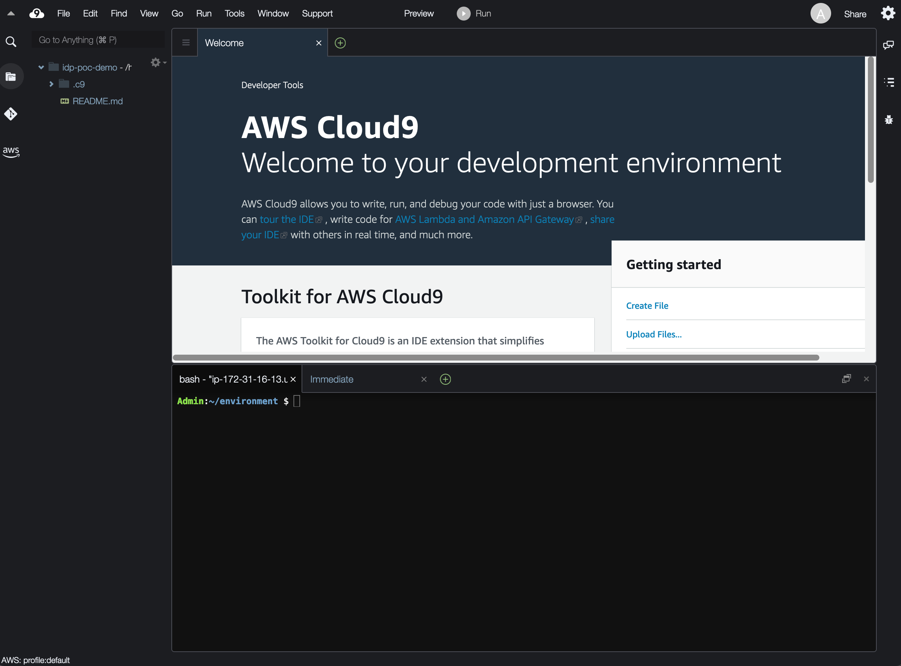

# Getting Started

You can deploy this demo from either your local machine or using a cloud IDE such as [AWS Cloud9](https://aws.amazon.com/cloud9/). In order to ensure a clean and error free deployment experience, we highly recommend using AWS Cloud9 to deploy the project into an AWS account. AWS Cloud9 environment comes pre-configured with all the development tools required to deploy this project so that you can quickly get started.

If you would prefer to deploy this from your local machine, please ensure the following dependencies are installed before proceeding.

| **Dependency**  | **Description**                                                                                                                                | **Version**                             | **Installation**                                                                         |
|-----------------|------------------------------------------------------------------------------------------------------------------------------------------------|-----------------------------------------|------------------------------------------------------------------------------------------|
| `node`  `npm`   | NodeJS and Node Package Manager                                                                                                                | latest (minimum `npm` v7 & `node` v14)  | [install](https://docs.npmjs.com/downloading-and-installing-node-js-and-npm)             |
| Docker          | Docker Desktop is an application for MacOS and Windows machines for the  building and sharing of containerized applications and microservices. | latest                                  | [install](https://www.docker.com/products/docker-desktop/)                               |
| AWS CDK Toolkit | The AWS CDK (Cloud Development Kit) Toolkit is a cli (command line interface) that is used to develop, build, and deploy CDK applications.     | latest                                  | [install](https://docs.aws.amazon.com/cdk/v2/guide/cli.html)                             |
| AWS CLI         | The AWS command line interface                                                                                                                 | latest                                  | [install](https://docs.aws.amazon.com/cli/latest/userguide/getting-started-install.html) |

---

## Setup AWS Cloud9 environment

Search for "Cloud9" from the top search bar of the AWS console, click on "Cloud9". Once in the Cloud9 console follow the steps-

1. On the Cloud9 console page click _"Create environment"_ button.


2. In the next screen, enter an environment name and an (optional) description. Click _"Next step"_


3. In the _"Configure settings"_ screen, change the _"Instance type"_ to *m5.large*, leave everything as default and click _"Next step"_


4. Review your selected values in the _"Review"_ screen and click _"Create environment"_

5. You will be navigated to the Coud9 IDE. Wait for the deployment to complete.


---

### Accessing the AWS Cloud9 Environment

Search for "Cloud9" on the top search bar of the AWS Console. Click on "Cloud9", you will be navigated to the AWS Cloud9 console where you will see the Cloud9 environment. Select the environment, and click _"Open IDE"_. You will be taken to the cloud IDE.



---

### Verify dependencies _(optional)_

Verify that you have all the dependencies required in the Cloud9 environment required to build and deploy the project. At the terminal found in the bottom of the IDE type the following commands. If you do not see a terminal, open a new terminal by clicking the "+" button next to a tab then clicking _"New Terminal"_.


Check `node` version

```bash
node -v
```

Check `npm` version

```bash
npm -v
```

Check `docker` version

```bash
docker --version
```

Check AWS CDK version

```bash
cdk --version
```

Check the AWS CLI version

```bash
aws --version
```

---

### Clone the project

While in the terminal window, clone this project repository using the command below by replacing the `<repo_url>` with the URL of this repository.

```bash
git clone <repo_url> idp-poc-demo
```

Once the repo clone is complete, you should now see a new directory `idp-poc-demo` in the left navigation pane of the Cloud9 IDE.

---